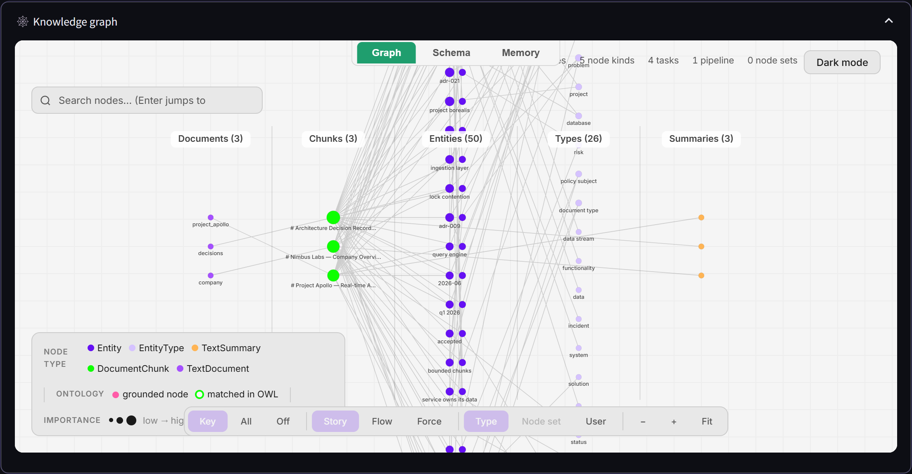
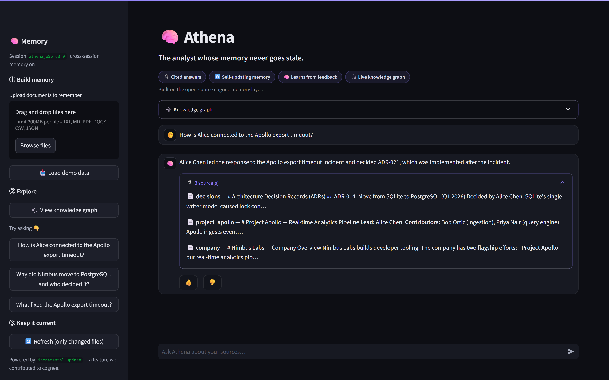
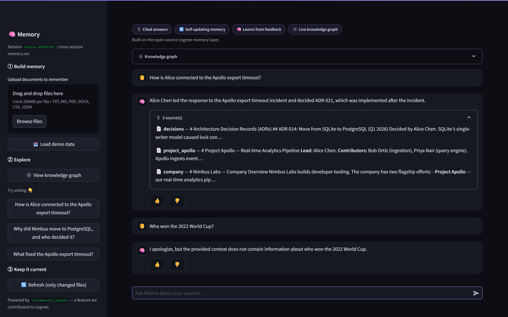
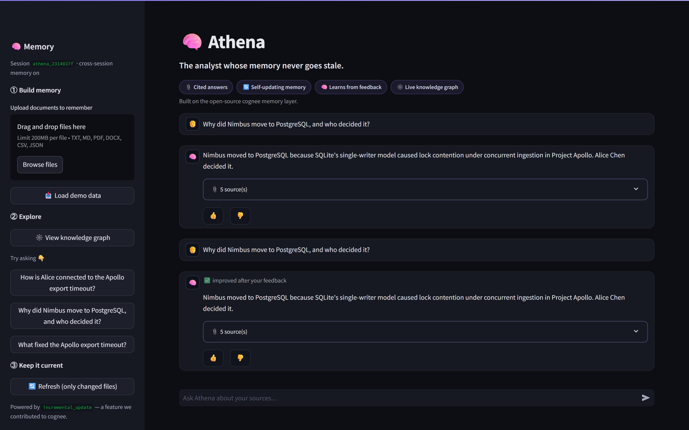
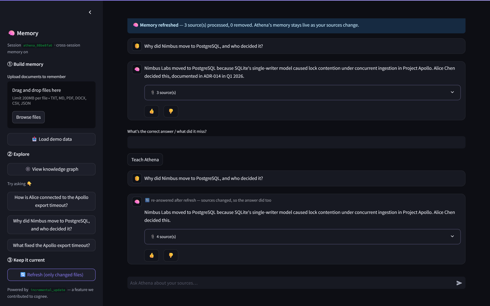
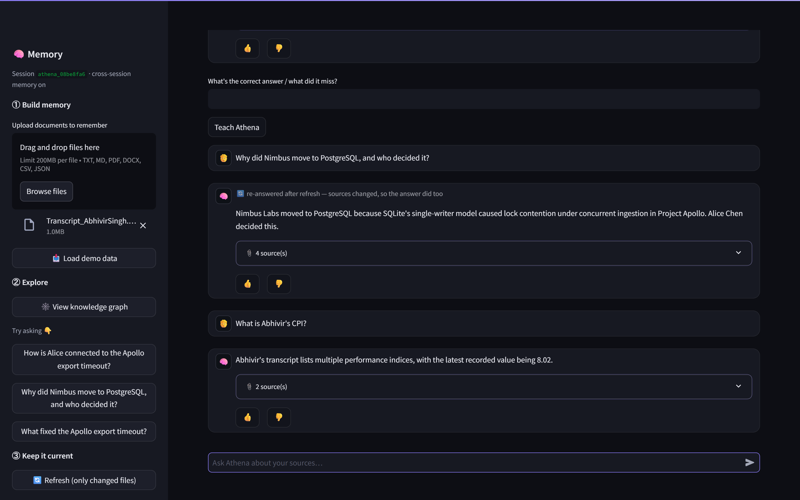

# Athena

### The analyst whose memory never goes stale.

Point Athena at a folder of **your** documents. It builds a knowledge graph, answers
your questions **with citations**, **learns** when you correct it, **auto-refreshes** when
the files change, and reads **even scanned PDFs**. It's a working demonstration of the full
[cognee](https://github.com/topoteretes/cognee) memory lifecycle — built by people who
**contribute to cognee upstream**.


> **Not a general chatbot.** Athena reasons only over the sources *you* give it, and every
> claim traces back to them. Ask something outside your documents and it says *"that's not
> in my memory"* — it will not guess. This is memory over **your** knowledge, not a model
> reciting the internet.

---

## Why this wins on substance

Most "AI memory" demos ingest once and answer once. Athena runs the **entire lifecycle on
screen** — and closes loops the others don't:

| | Typical memory demo | **Athena** |
|---|---|---|
| Sources for answers | None — trust me | **Cited**, traceable to the file |
| Out-of-scope question | Hallucinates | **Refuses honestly**, zero phantom citations |
| You correct it | Ignored | **Learns** (`cognee.improve`) and re-answers |
| A source file changes | Goes stale | **Auto-refreshes** (only the changed file) |
| Scanned / image PDF | Unreadable | **OCR'd** and made searchable |
| Infra | A database server | **Plain files** — nothing to run |

Every one of those is demoable in three minutes, live.

## The full cognee lifecycle, on screen

Athena is a thin, honest wrapper over cognee — each control maps 1:1 to a cognee memory verb:

| Control | cognee call | What it does |
|---|---|---|
| **📥 Remember** | `add` + `cognify` | Ingest a folder → build a knowledge graph |
| **💬 Recall** | `recall(include_references=True)` | Cited answer, scoped to your session |
| **👎 Teach** | `add` correction + `improve` | Learn from feedback; the next answer is better |
| **🔄 Refresh** | `incremental_update` | Re-read only changed files; prune removed ones |
| **🗑️ Forget** | `forget` | Prune stale sources |
| **🕸️ Graph** | `visualize_graph` | See exactly what it knows |

It also uses cognee **sessions** for cross-session memory (close it, reopen it — the whole
conversation is still there) and cognee's **hybrid graph + vector** retrieval.

## What it can do that surprises people

- **Cited by default.** Answers carry their source snippets, parsed out of cognee's evidence
  block into a clean citation list.
- **Honest refusals.** Ask about the 2022 World Cup with a corpus of engineering docs and it
  refuses — *and suppresses the fallback citations*, so a non-answer never looks sourced.
- **It reads scans.** A scanned transcript that yields **one character** of extractable text
  (just the page number) becomes fully queryable — Athena renders the pages, thresholds out
  the watermark, OCRs the text, and answers *"what is his CPI?" → 8.02*, correctly. No
  Tesseract, no system binaries — pure pip, so it deploys anywhere.
- **Self-updating.** Edit a source, hit Refresh, and Athena re-asks your last question so you
  watch the answer change to match the new file.

## How it works

```
folder ──add──▶ cognee ──cognify──▶  knowledge graph        (Kuzu)
                                     + vector embeddings    (LanceDB, 3072-dim)
                                     + metadata / sessions  (SQLite)
                                            │
your question ──recall──▶ hybrid graph+vector retrieval ──▶ cited answer
```

- **`memory.py`** — the cognee lifecycle wrapper (remember / recall / teach / forget /
  refresh / graph) plus the OCR path for scanned PDFs.
- **`app.py`** — the Streamlit UI: chat with cited answers, the feedback loop, the live graph.
  Runs every cognee call on one persistent background event loop so cognee's cached DB engines
  survive Streamlit reruns, and wraps them so a transient API hiccup never crashes the demo.
- **Storage** — entirely file-based under `.cognee/` (Kuzu graph + LanceDB vectors + SQLite).
  No server, no cloud. Rebuilt from your sources on first run.
- **Model** — Gemini `gemini-2.5-flash` for reasoning, `gemini-embedding-001` (3072-dim) for
  embeddings, via cognee.

## Quickstart

```bash
pip install -r requirements.txt          # cognee[gemini] + streamlit + OCR stack
cp .env.example .env                      # paste your Gemini API key into .env
streamlit run app.py                      # → http://localhost:8501
```

Then, in the sidebar, click **📥 Load demo data** (or drag in your own files) and start
asking. No infrastructure to stand up — every database is a local file.

## Three-minute demo

1. **Load demo data** (or upload your own) → open **View knowledge graph** and watch the entities connect.
2. **Ask** *"How is Alice connected to the Apollo export timeout?"* → a cited answer that spans
   multiple files.
3. **Ask** *"Who won the 2022 World Cup?"* → an honest refusal, with **no** citations.
4. **Correct it** — 👎 a weak answer, type the fix, **Teach Athena**, and it re-answers, better.
5. **Change a source** — edit a file in `demo_data/`, hit **Refresh**, and the answer updates.
6. **Drop a scanned PDF** → **OCR** kicks in and it becomes queryable.

See [AUTO_REFRESH.md](AUTO_REFRESH.md) for the never-stale-memory mechanism in detail.

## Built by cognee contributors

Athena's auto-refresh isn't a wrapper around someone else's API — it's **our own feature,
shipped upstream and dogfooded here**:

- **[cognee#3797](https://github.com/topoteretes/cognee/pull/3797)** — `incremental_update`
  and `cognee hook install` (issue **[#3669](https://github.com/topoteretes/cognee/issues/3669)**).
- **cognee-integrations #200** — post-commit hook timing.

Install the git hook and memory refreshes on every commit, hands-free:

```bash
cognee hook install --path ./demo_data --dataset-name athena
```

That's the difference between *using* open-source cognee and *building* it.

## Screenshots

| Knowledge graph | Cited answer | Honest refusal (no sources) |
|---|---|---|
|  |  |  |
| **Learns from 👎 feedback** | **Refresh — the answer updates** | **Reads a scanned PDF (OCR)** |
|  |  |  |

## Tech stack

Streamlit · cognee (Kuzu · LanceDB · SQLite) · Gemini 2.5 Flash · PyMuPDF + rapidocr-onnxruntime (OCR)

## Notes

- `.env` (your API key) is gitignored — never commit it.
- The `.cognee/` store is rebuilt from your sources; it isn't part of the repo.
